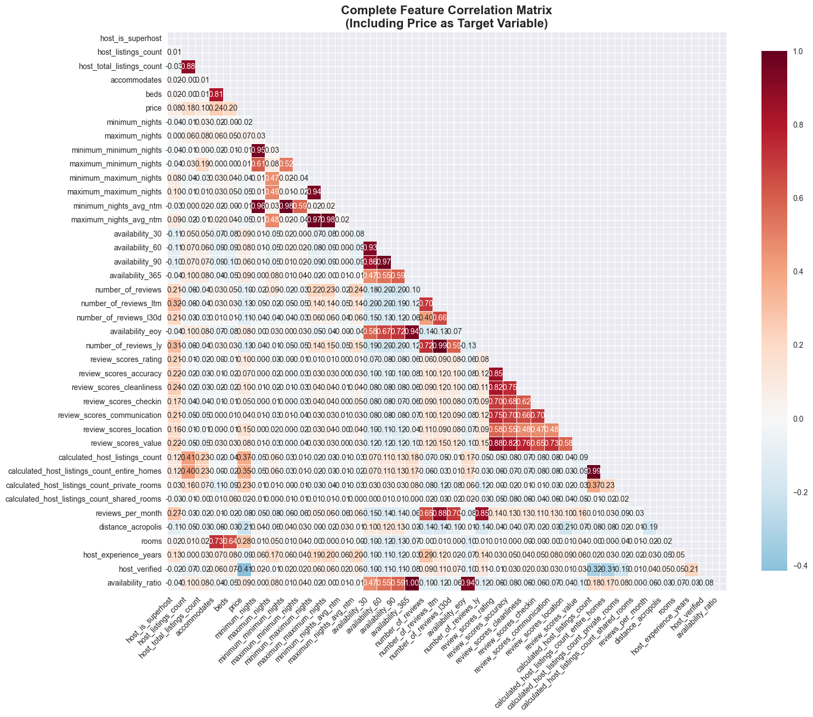
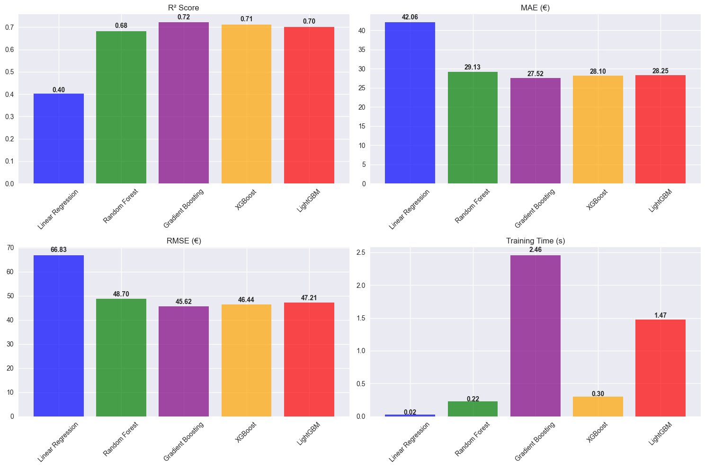
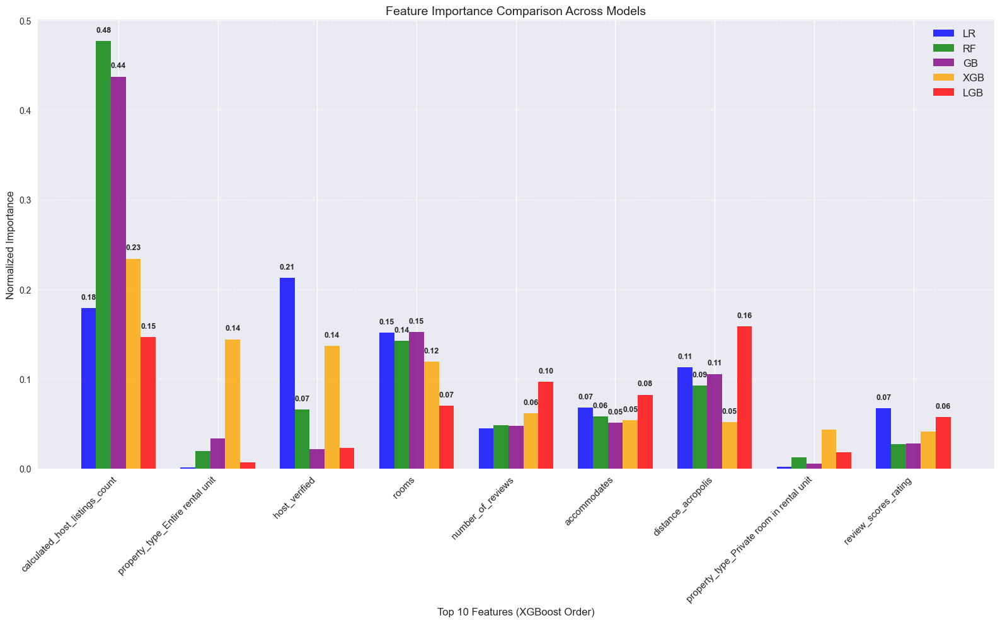

# Short-term Rentals Price Prediction

A comprehensive machine learning study for predicting short-term rental prices in Athens, Greece, featuring advanced feature engineering, different machine learning model training and comparison.

## Table of Contents
1. **[ Dataset](#dataset)** 
2. **[ Data Cleaning](#data-cleaning)** 
3. **[ Feature Engineering](#feature-engineering)** 
4. **[ Feature Selection & Model Preprocessing](#feature-selection--model-preprocessing)**
5. **[ Model Comparison](#model-training)** 
6. **[ Top Features](#top-performing-features)** 
7. **[ Key Business insights](#key-business-insights)** 
8. **[ Future Improvements](#future-improvements)** 
9. **[ Limitations](#limitations)**

## Dataset
This dataset contains listings web-scraped from airbnb through an open-source project called Inside.Airbnb.
- **Source**: https://insideairbnb.com/ 
- **Size**: 15,000+ listings
- **Features**: Property characteristics, host information, location data, review metrics
- **Target**: Nightly rental price (EUR)

## Data Cleaning

- **Price Column:** - Removed currency sign
- **Outlier Removal:** - Conservative approach using 0.5% and 99.5% quantiles for price filtering and median imputation for reviews.
- **Propery Type Column:** - Cleaned similar names and removed types that appear rarely

## Feature Engineering

- **Location Features**: Distance to Acropolis using manhattan calculation
- **Host Quality**: Experience, verification status 
- **Review Patterns**: Review scores, number of reviews
- **Booking Dynamics**: Availability ratio

## Feature Selection & Model Preprocessing

### **Feature Selection**

**Check for multicollinearity**

Highly correlated features removed.

**Train a Random Forest and XGBoost model for feature selection.**

After testing different features, the final models uses **10 key features** that demonstrated the highest predictive power:

**Numerical Features (9):**
- `rooms`,`accommodates`,
- `calculated_host_listings_count`,
- `distance_acropolis`, `host_experience_years`,
- `host_verified`,  `availability_ratio`,
- `review_scores_rating`,`number_of_reviews`

**Categorical Features (1):**
- `property_type`

### **Data Preprocessing**

**Missing Value Imputation Strategy:**
- **Numerical features**: Median imputation for robust handling
- **Review features**: Fill 0 for new listings without reviews

**Feature Scaling:**
- **StandardScaler** applied to all numerical features
- Ensures equal weight across features with different scales
- Critical for XGBoost, not needed for LightGBM

**Categorical Encoding:**
- **One hot encoding** : for propery type column

**Train/Test Split:**
- **80/20 split** with stratified sampling by neighborhood
- **Random state fixed** for reproducible results
- **Train/test/eval split** for XGBoost and LGBM for early stopping to reduce overfitting

## Model Training
**I trained and tuned five different machine learning models to see which performs better using R², RMSE, MAE, Training Time as model evaluation metrics**

### Model Comparison

### Test for Overfitting

**Overfitting Check**

| Model | Train R² | Test R² | R² Gap | Test MAE | Test RMSE | Time (s) |
|-------|----------|---------|--------|----------|-----------|----------|
| Gradient Boosting | 0.748 | 0.721 | 0.027 | 27.523 | 45.619 | 2.457 |
| XGBoost | 0.711 | 0.711 | -0.000 | 28.100 | 46.443 | 0.302 |
| LightGBM | 0.732 | 0.701 | 0.030 | 28.251 | 47.211 | 1.474 |
| Random Forest | 0.705 | 0.682 | 0.023 | 29.132 | 48.705 | 0.225 |
| Linear Regression | 0.383 | 0.402 | -0.019 | 42.059 | 66.834 | 0.023 |

XGBoost has the lowest overfitting and significantly faster training time. I would choose this over Gradient boosting.
Even though Gradient Boosting has better test R² it is slightly overfitted and a lot slower.

## Top Performing Features

Based on feature importance analysis across all five models, here are the key insights from Athens short-term rental pricing patterns:

### **Most Critical Features**

**1. Host Credibility & Portfolio**
- **`host_verified`**  Host verification is an important pricing factor
- **`calculated_host_listings_count`**  Professional hosts with multiple properties command significantly higher prices

**2. Property Fundamentals**
- **`rooms`** More rooms --> Higher Price 
- **`accommodates`**  More guests --> Higher Price

**3. Location Intelligence**
- **`distance_acropolis`** Proximity to Athens' main attraction

**4. Host Experience & Quality**
- **`host_experience_years`** Seasoned hosts optimize pricing better
- **`review_scores_rating`** High ratings enable premium pricing

**5. Property Management Strategy**
- **`availability_ratio`** availability affects pricing
- **`property_type`** Property classification impacts market positioning

## Key Business Insights

**Location Pays**: The engineered distance-to-Acropolis feature proves location premium is quantifiable. Properties within walking distance of major attractions command measurable premiums.

**Experience Premium**: Hosts with years of experience and high review scores can optimize pricing strategies that newer hosts cannot match.

**Professional vs Amateur Gap**: The importance of `calculated_host_listings_count` reveals a significant pricing gap between occasional hosts (1-2 listings) and professional operators (5+ listings), probably due to more premium offerings and amenities and higher operating costs

## Future Improvements

1. **Temporal Analysis**: Seasonal pricing patterns and demand forecasting
2. **Deep Learning**: Neural network architectures for complex feature interactions
3. **Multi-City Models**: Generalization across different cities
4. **Dynamic Pricing**: Real-time price optimization algorithms
5. **External Factors**: Integration of events, weather, and economic indicators

## Limitations

**The dataset provided by inside.airbnb contains listings only near the center of Athens, suburb areas are not included so the prediction of these neighboorhoods will not be accurate**